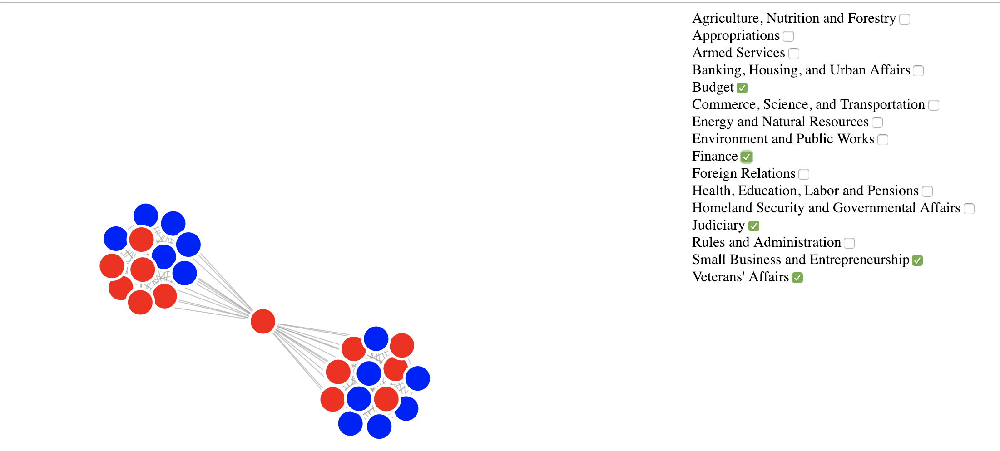
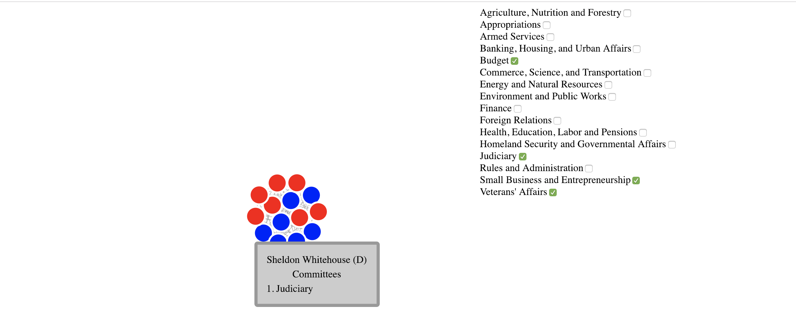

# U.S. Senators by Committee Relationships

Data from 2018 and predates special election races in Alabama and Minnesota to replace Luther Strange and Al Franken

#Demo:

All committees selected:

Shared committees:

Selecting one senator:

